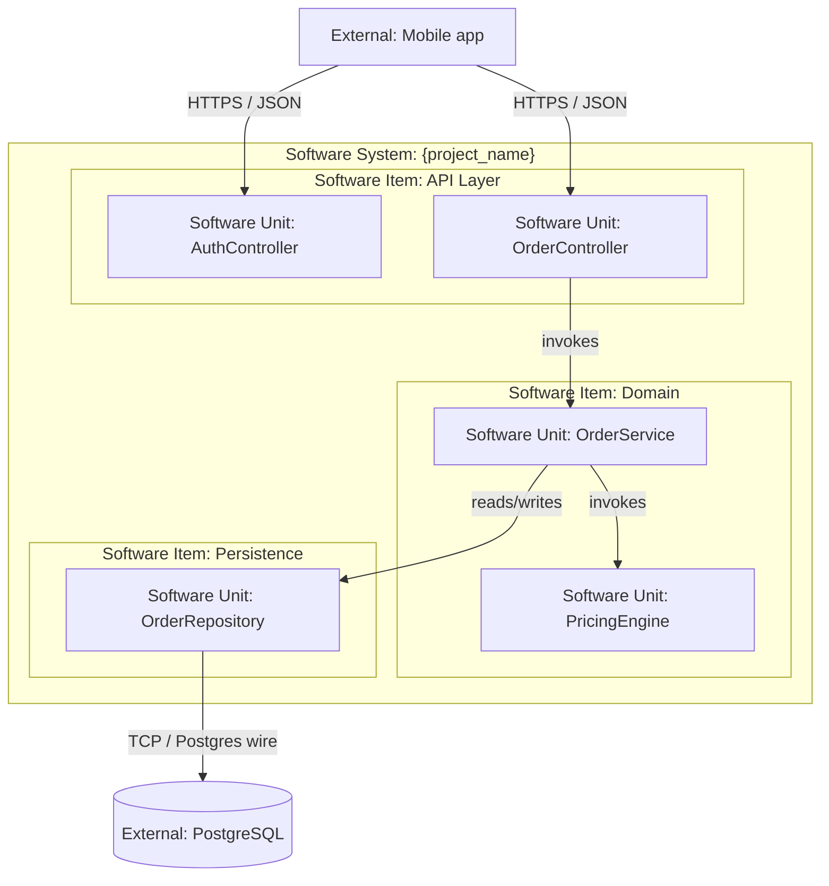
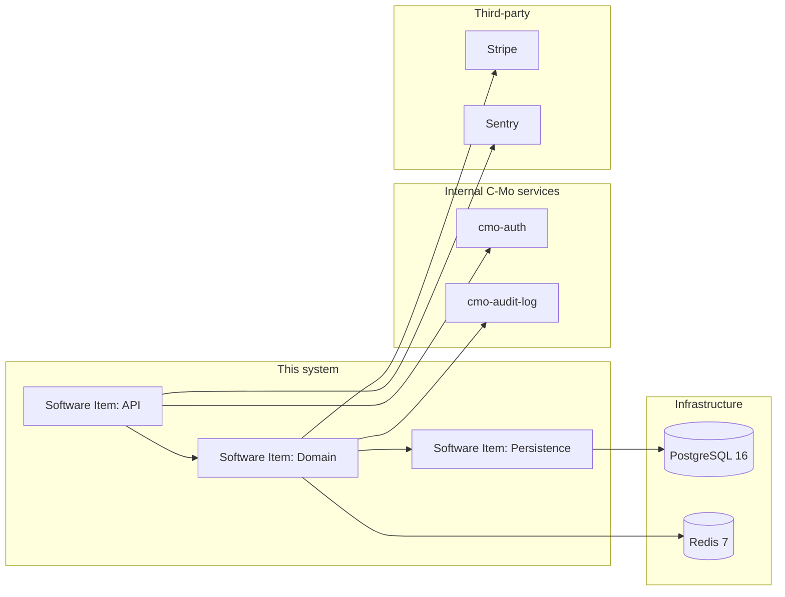
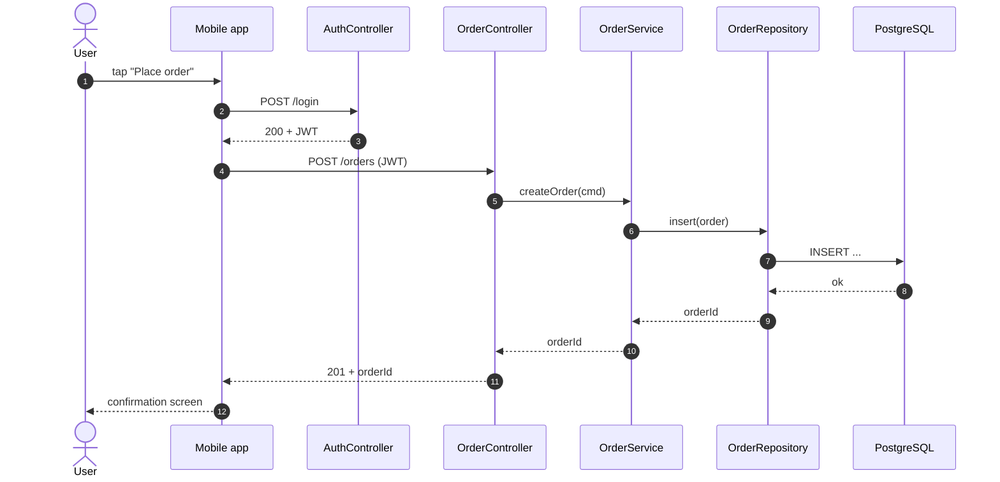
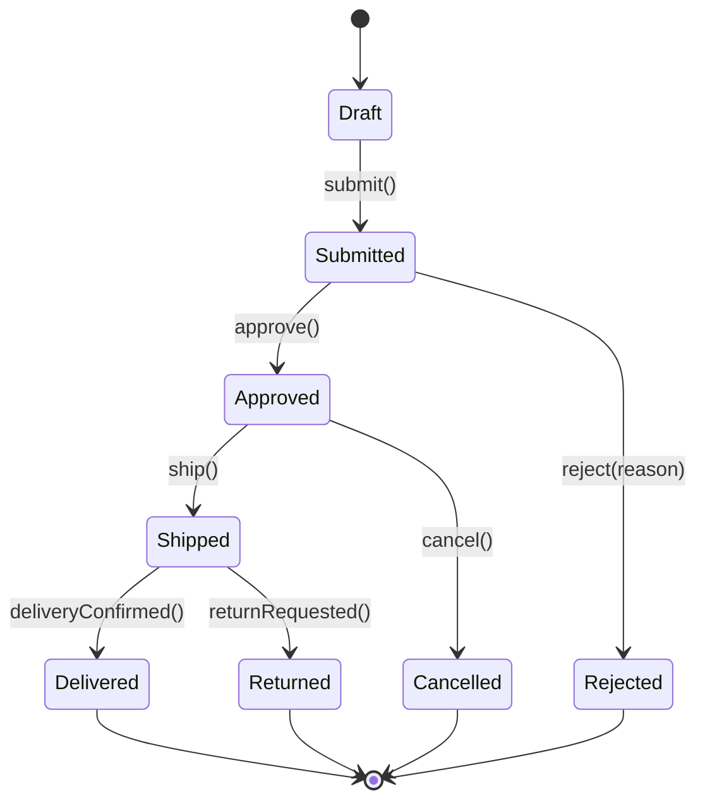
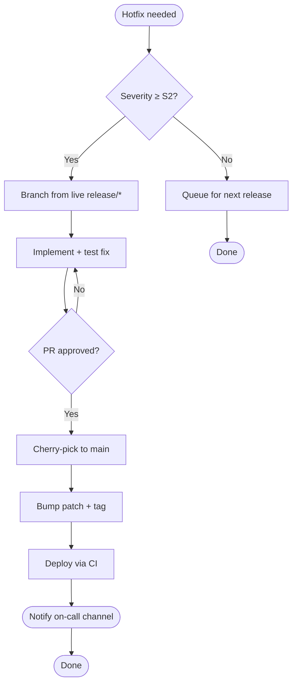

# Upgrade Documentation

Bring a repository's `README.md` and `docs/` diagrams in line with the C-Mo documentation standard. The goal is that any engineer (or auditor) can land in the repo and, within ten minutes, understand:

1. What the project is and where it sits in the system.
2. How to run it locally, per environment.
3. How the software is decomposed (IEC 62304: System → Items → Units) and how the pieces interact.
4. How to ship a change — feature, release, or hotfix.

## When to use

- A repo's README is missing, stale, or doesn't match the skeleton below.
- Architectural diagrams are missing, ad-hoc PNGs, or don't reflect the current code.
- A new environment (e.g. staging, validation, production) was added and isn't documented.
- During an audit prep (IEC 62304 § 5.3, § 5.4 — software architecture and detailed design records).

## Safety rules (non-negotiable)

1. **Never delete existing diagrams or sections without confirmation.** Read the current README first; preserve any project-specific content that doesn't fit the skeleton (move it under `## Additional resources` rather than dropping it).
2. **Do not invent environment URLs, deploy steps, or credentials.** If you don't know a value, leave a `TODO:` marker with a precise question — never guess production hostnames or secret paths.
3. **Diagrams must reflect the actual code.** Read the repo before drawing. If you can't verify a relationship from the source, mark it `(unverified)` in the diagram caption rather than asserting it.
4. **All diagrams are Mermaid, embedded in Markdown.** No PNGs, no draw.io exports, no Visio. The diagram source must be diffable.
5. **Architecture diagrams use IEC 62304 vocabulary** — `Software System`, `Software Item`, `Software Unit`. Do not substitute "module", "service", "component" at the architecture level; reserve those for internal prose.

## Procedure

Run each step in order. Stop and report on any unrecoverable issue.

### 1. Inventory what exists

```bash
ls README.md docs/ 2>/dev/null
find docs -name '*.md' -o -name '*.mmd' 2>/dev/null
```

Read the current `README.md` end-to-end and any files under `docs/`. Note which sections of the skeleton (below) are already present, which are stale, and which are missing.

### 2. Detect the project type

Look at the repo root to pick the right tone and prerequisites:

| Signal | Project type |
|---|---|
| `pyproject.toml`, `requirements*.txt` | Python service / library |
| `package.json` with `react`/`vue` | Frontend app |
| `*.csproj`, `*.sln` | .NET service |
| `platformio.ini`, `CMakeLists.txt`, `*.ioc` | Firmware |
| `Dockerfile` + `docker-compose.yml` at root | Containerised service (any stack) |

This drives the **Prerequisites** and **How to install/run** sections.

### 3. Rewrite `README.md` against the skeleton

Use the skeleton in [§ README skeleton](#readme-skeleton) below. Rules:

- Drop the hand-maintained Table of Contents — GitHub auto-generates one from the outline button.
- Merge the three release subsections ("How to Deploy", "How to release a new version", "How to release a bug fix") into a single **Release** section with a hotfix callout.
- The **Environments** section is mandatory if the project deploys anywhere (any service, any frontend). Libraries and firmware that only produce artefacts can omit it.
- Coding-guidelines link moves to **Additional resources**, not under Development.
- Every `{placeholder}` from a template must be resolved or replaced with a `TODO:` marker.

### 4. Add or update diagrams under `docs/`

Create `docs/diagrams/` if missing. One diagram per file, named by purpose:

```
docs/
└── diagrams/
    ├── architecture.md       # IEC 62304 block diagram (Items → Units)
    ├── dependencies.md       # External + internal dependencies
    ├── sequence-<flow>.md    # One per important flow, e.g. sequence-login.md
    ├── state-<entity>.md     # One per stateful entity, e.g. state-order.md
    └── flow-<process>.md     # One per process, e.g. flow-deploy.md
```

Diagram types and when to use each are in [§ Diagrams](#diagrams) below.

The README's **Architecture** section embeds the architecture diagram inline; other diagrams are linked from there ("See [sequence-login.md](docs/diagrams/sequence-login.md) for the auth flow").

### 5. Cross-link and verify

- The README's **Repository layout** section names every top-level folder and matches `ls -1` output.
- Every diagram's nodes correspond to real files/folders/services. Spot-check three at random.
- All Mermaid blocks render — paste each into <https://mermaid.live> if unsure, or open the file in an IDE with a Mermaid preview.

### 6. Report

End with a summary in this shape:

```
README:    rewrote against skeleton (sections added: Architecture, Environments)
Diagrams:  added 4 under docs/diagrams/ (architecture, dependencies, sequence-login, state-order)
TODOs:     3 markers left (staging URL, hotfix runbook, prod deploy approver)
Next:      teammate fills TODOs, opens PR
```

---

## README skeleton

```markdown
  

# {project_name}

**Status:** active | maintenance | archived
**Owners:** {team or individuals}

One-paragraph description: what this project does, who uses it, and where it sits in the wider C-Mo system. No marketing language — an engineer should be able to decide in 30 seconds whether this repo is relevant to their task.

## Architecture

One paragraph describing the decomposition at the **Software System** level and naming each **Software Item**. Embed the architecture diagram:

\`\`\`mermaid
{architecture diagram — see docs/diagrams/architecture.md}
\`\`\`

For deeper views see:
- [Dependencies](docs/diagrams/dependencies.md)
- [Sequence diagrams](docs/diagrams/) — one per important flow
- [State diagrams](docs/diagrams/) — one per stateful entity

## Repository layout

Briefly describe each top-level folder. Example:

| Path | Contents |
|---|---|
| `src/` | Production source — one subfolder per Software Item |
| `tests/` | Tier-structured tests (unit / integration / functional) |
| `docs/` | Mermaid diagrams, ADRs, design notes |
| `scripts/` | Local dev + CI helpers |

## Environments

| Environment | URL / Host | Branch | Deploy trigger | Secrets location |
|---|---|---|---|---|
| Local | `http://localhost:{port}` | any | `{run command}` | `.env.local` (gitignored) |
| Development | `https://dev.{...}` | `main` | auto on merge | Vault / KMS path |
| Staging | `https://staging.{...}` | `release/*` | manual via CI | Vault / KMS path |
| Production | `https://{...}` | `release/*` tag | manual + approval | Vault / KMS path |

Notes on environment differences (feature flags, data scope, third-party sandboxes) go below the table.

## Development

### Prerequisites

- Tool A version X
- Tool B version Y
- Access to: {Vault path, container registry, etc.}

### How to install / run

Step-by-step from a clean clone to a running local instance. Each block should be copy-pasteable.

### Usage

For libraries: API example. For services: how to call the main endpoints. For end-user apps: link to the user guide instead — this section is for engineers.

### How to develop a new feature

1. Pick up a Jira ticket from the {project key} board.
2. Branch from `main`: `git checkout -b feat/{ticket-id}-{slug}`.
3. Implement, following the relevant C-Mo conventions skill.
4. Run tests locally (see commands in **How to install / run**).
5. Open a PR via `/pr`. Tag the ticket in the PR body.
6. After review and merge, follow the **Release** section to ship.

## Release

### Versioning

{SemVer | CalVer | other} — explain in one line.

### How to release

1. Cut a `release/{version}` branch from `main`.
2. {CI / manual steps to promote through environments}.
3. Tag the release: `git tag {version} && git push --tags`.
4. {Post-release verification: smoke tests, dashboards to watch}.

### Hotfix

For a production bug fix bypassing the normal release cycle:

1. Branch from the live `release/*` branch, not `main`.
2. Land the fix, cherry-pick back to `main`.
3. Bump the patch version and re-tag.
4. Notify {channel / on-call}.

## Additional resources

- [Coding conventions]({link to Confluence / repo}) — language and project-specific rules
- [Jira project]({link})
- [Grafana / observability]({link})
- [Architecture Decision Records](docs/adr/) — if present
- [Swagger / OpenAPI]({link if applicable})
```

---

## Diagrams

All diagrams are **Mermaid**, embedded in Markdown files under `docs/diagrams/`. Each diagram file has a one-paragraph caption explaining what the reader is looking at and when it was last verified against the code.

### Architecture (block diagram, IEC 62304)

**Use when:** showing how the Software System decomposes into Software Items, and how each Software Item further decomposes into Software Units.

**Rules:**

- The outermost container is the **Software System** (the deployable thing).
- Direct children are **Software Items** — coarse subsystems that can be developed and verified independently.
- Leaves are **Software Units** — the smallest separately-testable element (a class, a module, a firmware driver). Each Software Unit corresponds to code that is unit-tested as a unit.
- Use `subgraph` blocks to denote Items containing Units. Do not nest Items more than two levels deep without reason — flatten if you can.
- Arrows show **runtime relationships** (calls / data flow), not "is-a" or "contains".
- Annotate every external boundary (network, hardware bus, file system) with the protocol.

**Template:**



### Dependencies (architecture level)

**Use when:** showing how Software Items depend on external systems, libraries, and infrastructure. One level above the architecture diagram in abstraction — no Software Units appear here.

**Rules:**

- Nodes are Software Items, external services, infrastructure, and significant third-party libraries.
- Arrow direction means "depends on" (A → B reads as "A depends on B").
- Group external dependencies by category (third-party SaaS, internal C-Mo services, infrastructure, OS-level).

**Template:**



### Sequence diagrams

**Use when:** showing the time-ordered interactions for a specific flow (a request, a job, a startup sequence).

**Rules:**

- One sequence diagram per flow. Do not cram multiple flows into one.
- Participants are Software Units or external systems — match the names used in the architecture diagram exactly.
- Annotate async boundaries (`-->>` for async / fire-and-forget; `->>` for sync call; `-->` for return value).
- If the flow has alternative paths, use `alt` / `else` blocks rather than drawing two diagrams.

**Template:**



### State diagrams

**Use when:** documenting the lifecycle of a stateful entity — an order, a device, a user session, a firmware mode.

**Rules:**

- One diagram per entity.
- Every transition is labelled with the event that triggers it.
- Mark the initial state with `[*]` and terminal states with a transition to `[*]`.
- If a state has internal sub-states (e.g. a firmware "Running" mode with sub-modes), use a composite state.

**Template:**



### Flowcharts (processes / workflows)

**Use when:** documenting a process that is **not** the runtime interaction of software components — release procedures, on-call runbooks, decision trees, manual data-correction workflows.

**Rules:**

- Do **not** use a flowchart to describe runtime software behaviour — use a sequence diagram for that.
- Decision diamonds must have clearly labelled outgoing edges (Yes / No, or the condition).
- Terminal nodes are rounded.

**Template:**



---

## Out of scope

- Generating diagrams from code via tools like Structurizr, PlantUML, or C4-PlantUML — we standardise on Mermaid for diffability and zero-tooling rendering on GitHub.
- Writing user-facing end-user manuals — this command is about engineering documentation.
- Producing IEC 62304 traceability matrices, risk analyses, or design history files — those live in the QMS, not the repo.
- Auto-syncing diagrams with code (e.g. via doc-generators). Diagrams here are hand-maintained and reviewed like code.
